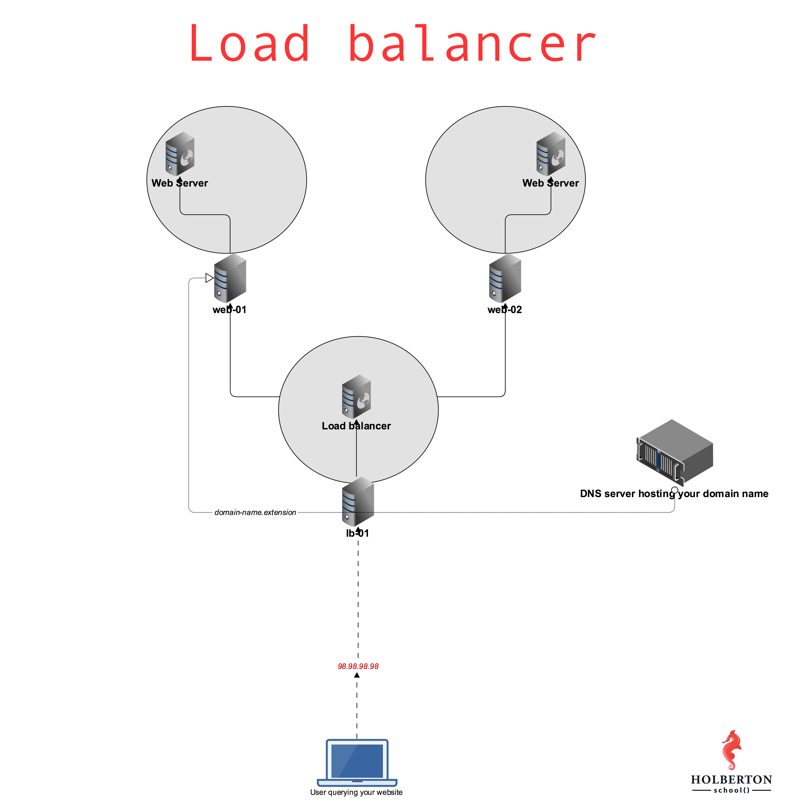

# 0x0F. Load balancer

## About

This is an educational project to explore the concept of load balancer

## Topics

### General

-  What is a load balancer
-  Why load balancers
-  What is redundacys



## Requirements

-  Ubuntu 16.04 LTS
-  Shellcheck 0.3.7

## Resourses

### Read or watch

-  [Introduction to load-balancing and HAproxy](https://www.digitalocean.com/community/tutorials/an-introduction-to-haproxy-and-load-balancing-concepts)
-  [HTTP header](https://www.techopedia.com/definition/27178/http-header)
-  [Debian/Ubuntu HAProxy packages](https://haproxy.debian.net/)
-  [Nginx add_header directive](https://blog.confirm.ch/adding-and-removing-nginx-response-headers/)
-  [Nginx add_header documentation](http://nginx.org/en/docs/http/ngx_http_headers_module.html#add_header)
-  [Nginx variables](http://nginx.org/en/docs/varindex.html)
-  [Set variables Nginx](https://www.javatpoint.com/nginx-variables)
-  [How to get a docker container ip addres](https://www.freecodecamp.org/news/how-to-get-a-docker-container-ip-address-explained-with-examples/)
-  [HAProxy crash course](https://www.youtube.com/watch?v=qYnA2DFEELw)
-  [Configure Nginx](https://www.linode.com/docs/guides/how-to-configure-nginx/)
-  [Install HAProxy load balancer on CentOS](https://upcloud.com/community/tutorials/haproxy-load-balancer-centos/)

### Concepts

-  [Load Balancer](https://intranet.hbtn.io/concepts/46)
-  [Web stack debugging](https://intranet.hbtn.io/concepts/68)

### Commands of interest

-  `docker inspect container_id | grep IPAddress`

## File Descriptions

This project is conceived to be carried out step by step, that is why the description of the files is presented as a statement.

### 0. Double the number of webservers

**[0-custom_http_response_header](0-custom_http_response_header)**

In this first task you need to configure `web-02` to be identical to `web-01`. Fortunately, you built a Bash script during your **web server project**, and they’ll now come in handy to easily configure `web-02`. Remember, always try to automate your work!

Since we’re placing our web servers behind a load balancer for this project, we want to add a custom Nginx response header. The goal here is to be able to track which web server is answering our HTTP requests, to understand and track the way a load balancer works. More in the coming tasks.

Requirements:

-  Configure Nginx so that its HTTP response contains a custom header (on `web-01` and `web-02`)
   -  The name of the custom HTTP header must be `X-Served-By`
   -  The value of the custom HTTP header must be the hostname of the server Nginx is running on
   -  Write `0-custom_http_response_header` so that it configures a brand new Ubuntu machine to the requirements asked in this task

**Ignore SC2154 for shellcheck**

Example:

```
sylvain@ubuntu$ curl -sI 34.198.248.145 | grep X-Served-By
X-Served-By: 03-web-01
sylvain@ubuntu$ curl -sI 54.89.38.100 | grep X-Served-By
X-Served-By: 03-web-02
sylvain@ubuntu$
```

If your server’s hostnames are not properly configured (`[STUDENT_ID]-web-01` and `[STUDENT_ID]-web-02`.), follow this [tutorial](https://aws.amazon.com/es/premiumsupport/knowledge-center/linux-static-hostname/).

### 1. Install your load balancer

**[1-install_load_balancer](1-install_load_balancer)**

Install and configure HAproxy on your `lb-01` server.

Requirements:

-  Configure HAproxy with version equal or greater than 1.5 so that it send traffic to `web-01` and `web-02`
-  Distribute requests using a roundrobin algorithm
-  Make sure that HAproxy can be managed via an init script
-  Make sure that your servers are configured with the right hostnames: `[STUDENT_ID]-web-01` and `[STUDENT_ID]-web-02`. If not, follow this [tutorial](https://aws.amazon.com/es/premiumsupport/knowledge-center/linux-static-hostname/).
-  For your answer file, write a Bash script that configures a new Ubuntu machine to respect above requirements

Example:

```
sylvain@ubuntu$ curl -Is 54.210.47.110
HTTP/1.1 200 OK
Server: nginx/1.4.6 (Ubuntu)
Date: Mon, 27 Feb 2017 06:12:17 GMT
Content-Type: text/html
Content-Length: 30
Last-Modified: Tue, 21 Feb 2017 07:21:32 GMT
Connection: keep-alive
ETag: "58abea7c-1e"
X-Served-By: 03-web-01
Accept-Ranges: bytes

sylvain@ubuntu$ curl -Is 54.210.47.110
HTTP/1.1 200 OK
Server: nginx/1.4.6 (Ubuntu)
Date: Mon, 27 Feb 2017 06:12:19 GMT
Content-Type: text/html
Content-Length: 612
Last-Modified: Tue, 04 Mar 2014 11:46:45 GMT
Connection: keep-alive
ETag: "5315bd25-264"
X-Served-By: 03-web-02
Accept-Ranges: bytes

sylvain@ubuntu$
```

### 2. Add a custom HTTP header with Puppet

**[2-puppet_custom_http_response_header.pp](2-puppet_custom_http_response_header.pp)**

Just as in task #0, we’d like you to automate the task of creating a custom HTTP header response, but with Puppet.

-  The name of the custom HTTP header must be `X-Served-By`
-  The value of the custom HTTP header must be the hostname of the server Nginx is running on
-  Write `2-puppet_custom_http_response_header`.pp so that it configures a brand new Ubuntu machine to the requirements asked in this task
